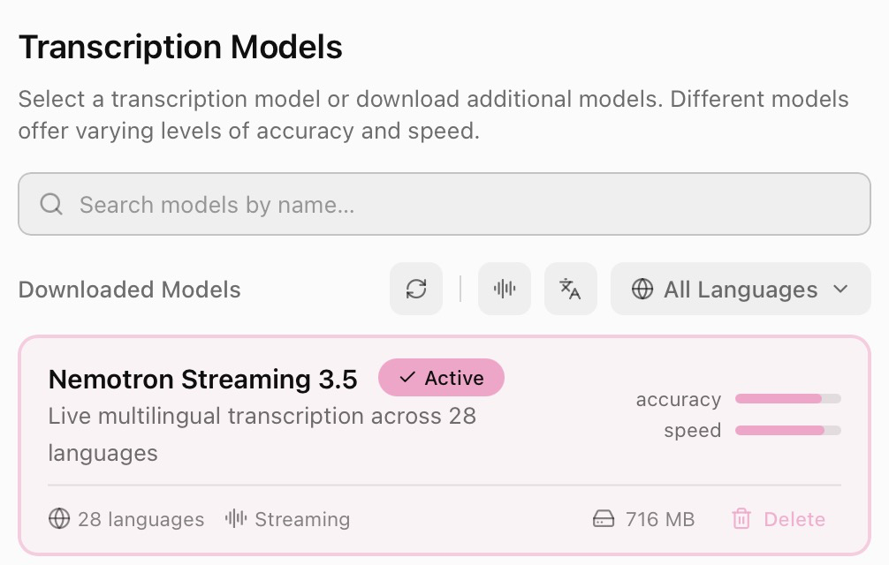
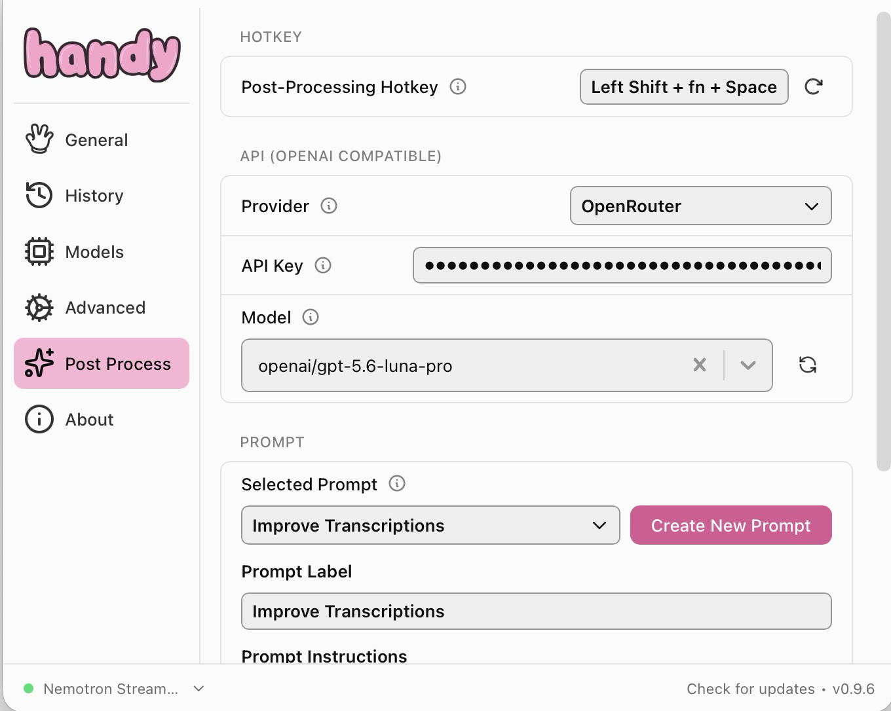

# Better Handy transcriptions with AI post-processing

[Handy](https://github.com/cjpais/handy) is a free, open-source speech-to-text app that can transcribe audio locally and paste the result into any application.

This repository contains the prompt I use to clean up Handy's raw transcriptions with an LLM through OpenRouter. It removes false starts and repetitions, resolves spoken corrections, fixes likely recognition errors, and improves punctuation without summarizing or changing the intended meaning.

The complete prompt is available in [`prompt.md`](prompt.md).

## How the setup works

1. Install and configure [Handy](https://handy.computer/).
2. In **Models**, download and select a local transcription model. I currently use **Nemotron Streaming 3.5**.

   

3. Open **Settings → Advanced → Experimental Features** and enable **Post Processing**.
4. Open the new **Post Process** section in the sidebar.
5. Select **OpenRouter** as the provider and enter your OpenRouter API key.
6. Select the language model you want to use for post-processing. A capable instruction-following model works best; I currently use **GPT-5.6 Luna Pro**.
7. Create a prompt in Handy and paste the complete contents of [`prompt.md`](prompt.md) into **Prompt Instructions**.

   

8. Configure the dedicated post-processing hotkey.
9. Use that hotkey when you want Handy to transcribe, clean up, and paste your speech.

The `${output}` placeholder at the bottom of the prompt is required. Handy replaces it with the raw transcription before sending the request to the selected model.

## What the prompt handles

- Filler words, stuttering, repetitions, and abandoned sentences
- Spoken corrections such as “five tests, actually six”
- Dictation commands such as “delete this part” or “write this instead”
- Likely speech-recognition errors inferred from context
- Grammar, punctuation, paragraphing, and natural sentence structure
- Numbers, dates, measurements, names, and negations
- Dictated filenames containing words such as “underscore” and “dot”
- Incomplete time references without inventing “today,” “tomorrow,” or similar details

## Why Luna?

I chose GPT-5.6 Luna Pro because it is fast enough for everyday dictation and follows this prompt reliably. Nemotron 3.5 Lightning was faster, but its smaller model did not handle the instructions well enough. I had similar results with `gpt-oss-120b`: the speed was fine, but the edited text was less reliable.

Post-processing usually starts within a few seconds and a short request costs far less than one US cent. For my usage, this is much cheaper than a recurring subscription such as [Wispr Flow Pro](https://wisprflow.ai/pricing), which costs roughly $12–15 per month depending on the billing cycle.

## Privacy and cost

Handy performs the initial speech recognition locally when you use a downloaded transcription model. When cloud post-processing is enabled, the resulting raw transcript is sent through OpenRouter to the model you selected. Your audio is not part of that post-processing request.

The cost depends on the selected model and the length of the prompt and transcript. OpenRouter prices and model availability may change over time.

## References

- [Handy repository](https://github.com/cjpais/handy)
- [Handy post-processing documentation](https://handy.computer/docs/post-processing)
- [OpenRouter](https://openrouter.ai/)
